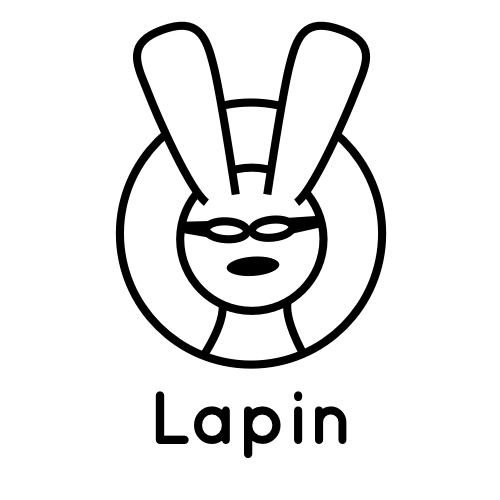

[](https://travis-ci.org/sozu-proxy/lapin)
[](https://coveralls.io/github/sozu-proxy/lapin?branch=master)
[](LICENSE)
[](https://deps.rs/repo/github/sozu-proxy/lapin)

# lapin, a Rust AMQP client library



[](https://crates.io/crates/lapin)

This project follows the AMQP 0.9.1 specifications, targetting especially RabbitMQ.

lapin is available on [crates.io](https://crates.io/crates/lapin) and can be included in your Cargo enabled project like this:

```toml
[dependencies]
lapin = "^0.26.9"
```

Then include it in your code like this:

```rust
use lapin;
```

## Example

```rust
use env_logger;
use lapin;
use log::info;

use crate::lapin::{
  BasicProperties, Channel, Connection, ConnectionProperties, ConsumerDelegate,
  message::Delivery,
  options::*,
  types::FieldTable,
};

#[derive(Clone,Debug)]
struct Subscriber {
  channel: Channel,
}

impl ConsumerDelegate for Subscriber {
  fn on_new_delivery(&self, delivery: Delivery) {
    self.channel.basic_ack(delivery.delivery_tag, BasicAckOptions::default()).as_error().expect("basic_ack");
  }
}

fn main() {
  env_logger::init();

  let addr = std::env::var("AMQP_ADDR").unwrap_or_else(|_| "amqp://127.0.0.1:5672/%2f".into());
  let conn = Connection::connect(&addr, ConnectionProperties::default()).wait().expect("connection error");

  info!("CONNECTED");

  let channel_a = conn.create_channel().wait().expect("create_channel");
  let channel_b = conn.create_channel().wait().expect("create_channel");

  channel_a.queue_declare("hello", QueueDeclareOptions::default(), FieldTable::default()).wait().expect("queue_declare");
  channel_b.queue_declare("hello", QueueDeclareOptions::default(), FieldTable::default()).wait().expect("queue_declare");

  info!("will consume");
  channel_b.clone().basic_consume("hello", "my_consumer", BasicConsumeOptions::default(), FieldTable::default()).wait().expect("basic_consume").set_delegate(Box::new(Subscriber { channel: channel_b }));

  let payload = b"Hello world!";

  loop {
    channel_a.basic_publish("", "hello", BasicPublishOptions::default(), payload.to_vec(), BasicProperties::default()).wait().expect("basic_publish");
  }
}

```

## lapin-futures

[](https://crates.io/crates/lapin-futures)

a library with a futures-0.1 based API, that you can use with executors such as tokio or futures-cpupool.

lapin-futures is available on [crates.io](https://crates.io/crates/lapin-futures) and can be included in your Cargo enabled project like this:

```toml
[dependencies]
lapin-futures = "^0.26.9"
```

Then include it in your code like this:

```rust
use lapin_futures;
```


